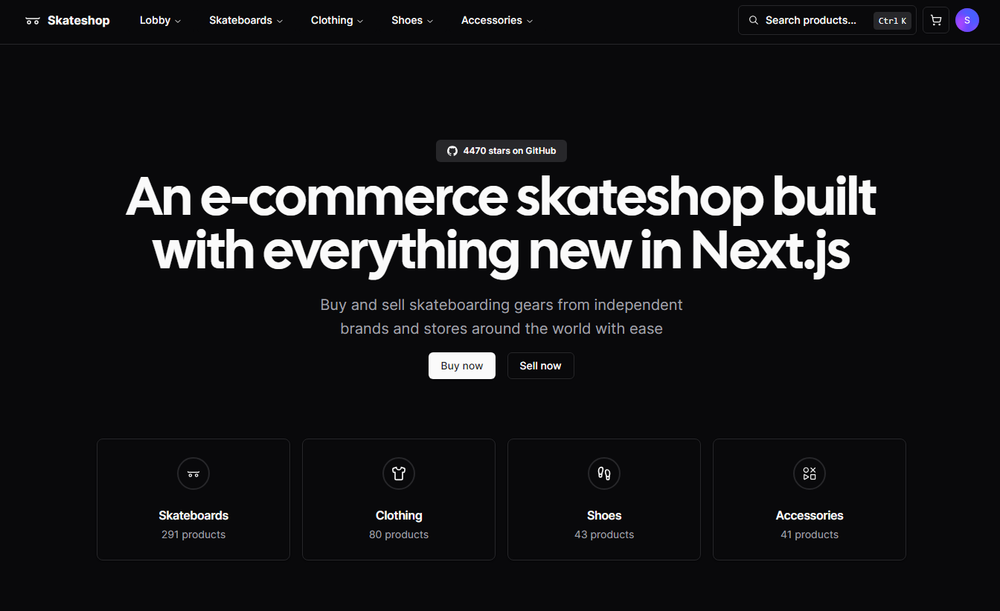

# [Skateshop](https://skateshop.sadmn.com/)

This is an open source e-commerce skateshop build with everything new in Next.js 13. It is bootstrapped with `create-t3-app`.

> This project is still in development and is not ready for production use.
>
> It uses new technologies (drizzle ORM) which are subject to change and may break your application.

## Tech Stack

- **Framework:** [Next.js](https://nextjs.org)
- **Styling:** [Tailwind CSS](https://tailwindcss.com)
- **User Management:** [Clerk](https://clerk.com)
- **ORM:** [Drizzle ORM](https://orm.drizzle.team)
- **UI Components:** [shadcn/ui](https://ui.shadcn.com)
- **Email:** [React Email](https://react.email)
- **Content Management:** [Contentlayer](https://www.contentlayer.dev)
- **File Uploads:** [uploadthing](https://uploadthing.com)
- **Payments infrastructure:** [Stripe](https://stripe.com)

## Features to be implemented

- [x] Authentication with **Clerk**
- [x] File uploads with **uploadthing**
- [x] Newsletter subscription with **React Email** and **Resend**
- [x] Blog using **MDX** and **Contentlayer**
- [x] ORM using **Drizzle ORM**
- [x] Database on **PlanetScale**
- [x] Validation with **Zod**
- [x] Storefront with products, categories, and subcategories
- [x] Seller and customer workflows
- [x] User subscriptions with **Stripe**
- [ ] Checkout with **Stripe Checkout**
- [ ] Admin dashboard with stores, products, orders, subscriptions, and payments

